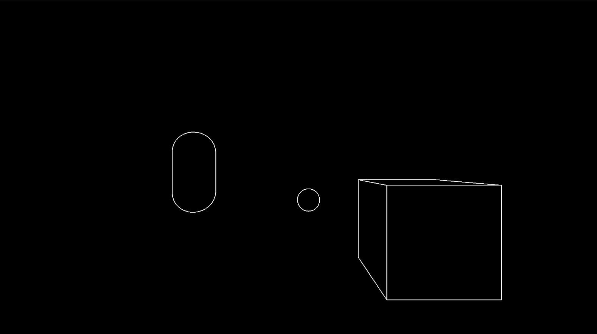
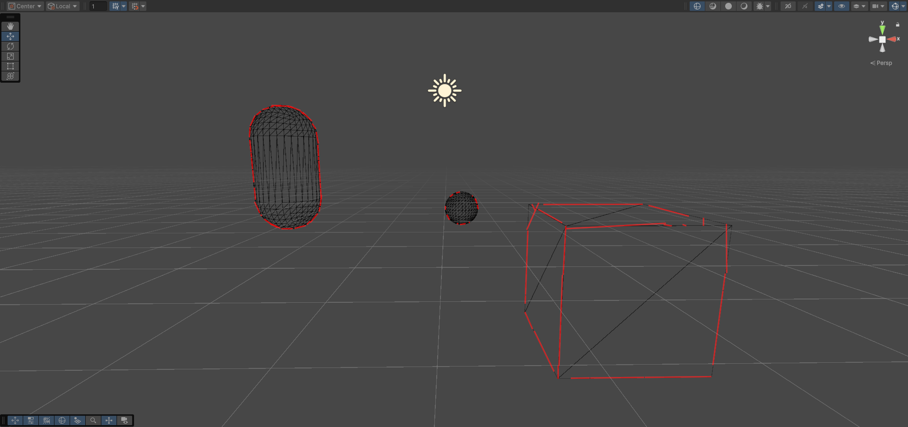

# 🔍 Unity Edge Detection & 3D Line Detection System

A real-time edge detection and 3D line segment extraction system for Unity, featuring **GPU-based RANSAC** and **Hough Transform** with **Burst Compiler** optimization.


---

## ✨ Features

- **Multiple Edge Detection Kernels**: Sobel, Roberts, Prewitt operators
- **Multiple Data Sources**: Luminance, Depth, Normals, or Combined mode
- **GPU RANSAC (MicroLines)**: Per-tile 3D line fitting entirely on GPU
- **Hough Transform**: Real-time 2D line segment detection (Burst optimized)
- **Async GPU Readback**: Non-blocking GPU→CPU data transfer
- **Real-Time Performance HUD**: Algorithm time, readback time, line count
- **Interactive Visualization**: Debug panels, normal arrows, Gizmo lines

---

## 📸 Screenshots

| Edge Detection | 3D Line Segments |
|:---:|:---:|
|  |  |

---

## 🏗️ Architecture

```
                        ┌─────────────────────────────────┐
                        │         Camera Render            │
                        └────────────────┬─────────────────┘
                                         ▼
                        ┌─────────────────────────────────┐
                        │   EdgeDetection.shader (GPU)     │
                        │   • Sobel/Roberts/Prewitt        │
                        │   • Depth/Normal/Color/Combined  │
                        └────────────────┬─────────────────┘
                                         ▼
              ┌──────────────────────────┴──────────────────────────┐
              ▼                                                     ▼
┌──────────────────────────┐                         ┌──────────────────────────┐
│  EdgeDirection.shader    │                         │  WorldPosBuffer.shader   │
│  (Gradient Direction)    │                         │  (3D World Positions)    │
└────────────┬─────────────┘                         └────────────┬─────────────┘
             │                                                     │
             ▼                                                     ▼
┌──────────────────────────┐                         ┌──────────────────────────┐
│   HoughLineDetector      │                         │  EdgeToMicroLines.compute│
│   (2D Line Segments)     │                         │  (GPU RANSAC per Tile)   │
│   • Burst Optimized      │                         │  • No CPU overhead       │
└──────────────────────────┘                         └────────────┬─────────────┘
                                                                  ▼
                                                     ┌──────────────────────────┐
                                                     │  WorldSpaceEdgeManager   │
                                                     │  (Async Readback + Gizmo)│
                                                     └──────────────────────────┘
```

---

## 🚀 Getting Started

### Requirements

- Unity 2021.3 or higher
- Burst Package (com.unity.burst)
- Mathematics Package (com.unity.mathematics)

### Installation

1. Clone this repository:
   ```bash
   git clone https://github.com/SametKaras/edge-detection-unity.git
   ```

2. Open the project in Unity Hub

3. Open `Assets/Scenes/SampleScene.unity`

4. Press Play to see edge detection in action

---

## 📁 Project Structure

```
Assets/
├── Scripts/
│   ├── SceneCapture/
│   │   └── EdgeDetectionEffect.cs     # Post-processing edge detection
│   ├── HoughTransform/
│   │   ├── EdgeFrameProcessor.cs      # GPU→CPU async transfer
│   │   ├── HoughLineDetector.cs       # Burst-optimized Hough Transform
│   │   ├── HoughNormalVisualizer.cs   # Debug visualization & kernel comparison
│   │   └── LineSegment2D.cs           # Data structures & parameters
│   └── WorldSpaceEdgeManager.cs       # GPU RANSAC pipeline manager
├── Shaders/
│   ├── EdgeDetection.shader           # Multi-kernel edge detection
│   ├── EdgeDirection.shader           # Multi-source gradient extraction
│   └── WorldPosBuffer.shader          # World position buffer
├── Resources/
│   └── EdgeToMicroLines.compute       # GPU RANSAC per-tile line fitting
├── Captures/                           # Test capture images
└── Scenes/
    └── SampleScene.unity
```

---

## ⚙️ Configuration

### Edge Detection Settings

| Parameter | Range | Description |
|-----------|-------|-------------|
| `Edge Threshold` | 0.001 - 1.0 | Minimum gradient magnitude for edge |
| `Method` | Sobel/Roberts/Prewitt | Edge detection kernel |
| `Source` | Luminance/Depth/Normal/Combined | Data source for detection |
| `Depth Sensitivity` | 0.1 - 100 | Depth edge sensitivity |
| `Normal Sensitivity` | 0.1 - 10 | Normal edge sensitivity |

### Hough Transform Settings

| Parameter | Range | Description |
|-----------|-------|-------------|
| `Theta Steps` | 90 - 360 | Angular resolution |
| `Peak Threshold` | 5 - 200 | Minimum votes for line |
| `Max Lines` | 10 - 500 | Maximum segments to detect |
| `Segment Min Length` | 3 - 100 | Minimum segment length (px) |

### 3D Line Detection (GPU RANSAC)

| Parameter | Range | Description |
|-----------|-------|-------------|
| `Kernel Size` | 3 - 7 | Tile size for per-tile RANSAC |
| `Min Points For Line` | 2 - 25 | Minimum edge points to fit a line |
| `Inlier Threshold` | 0.01 - 0.5 | Max distance for inlier classification |
| `Max Segment Length` | 0.01 - 10 | Maximum length of detected segments |

---

## ⚡ Performance

### Hough Transform (CPU)

| Optimization | Speedup | Description |
|--------------|---------|-------------|
| Burst Compiler | **43x** | VoteJob: 350ms → 8ms |
| Sin/Cos Lookup | 10-20x | Pre-computed tables |
| Gradient-Guided Voting | 78% less work | Vote only near gradient direction |

### 3D Line Detection (GPU)

| Feature | Description |
|---------|-------------|
| GPU RANSAC | Entire RANSAC runs on GPU — zero CPU overhead |
| Per-Tile Processing | Each 5×5 tile fits one micro-line independently |
| Async Readback | Results transferred without blocking main thread |
| Real-Time HUD | Algorithm time, readback time, line count overlay |

---

## 🎮 Controls

| Key | Action |
|-----|--------|
| Mouse Hover | Show segment info and normal vectors |
| Inspector | Adjust all parameters in real-time |

---

## 📊 Python Analysis

For offline point cloud analysis:

```bash
cd Assets
python AnalyzeLines.py
```

This generates 3D visualization of detected line segments from `PointCloudData.csv`.

---

## 🤝 Contributing

Contributions are welcome! Please feel free to submit a Pull Request.

---

## 📄 License

This project is licensed under the MIT License - see the [LICENSE](LICENSE) file for details.

---

## 🙏 Acknowledgments

- Hough Transform algorithm
- RANSAC line fitting
- Unity Burst Compiler team
