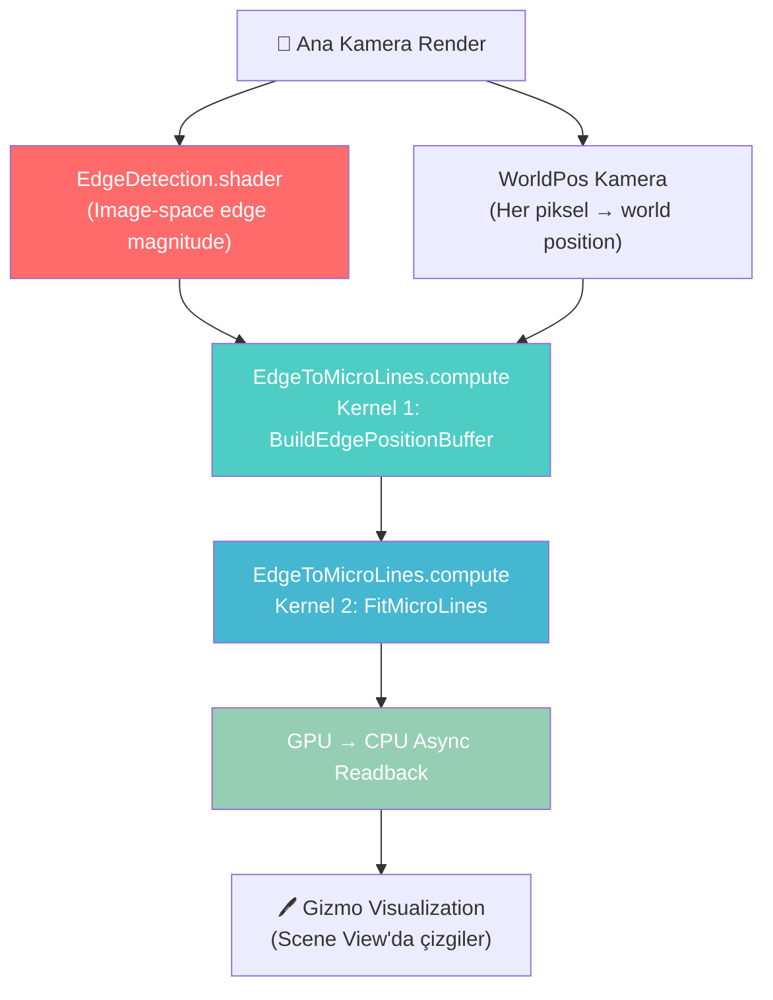

# Edge Detection Pipeline — Genel Bakış

## Pipeline Akışı



## Dosya Yapısı

| Dosya | Tür | Satır | Görev |
|-------|-----|-------|-------|
| `EdgeDetection.shader` | Fragment Shader | 342 | 2D image → edge magnitude haritası |
| `EdgeToMicroLines.compute` | Compute Shader | 762 | Edge pikselleri → 3D micro-line'lar |
| `WorldSpaceEdgeManager.cs` | C# MonoBehaviour | 423 | CPU tarafı orkestrasyon |
| `EdgeDetectionEffect.cs` | C# MonoBehaviour | 110 | Shader parametreleri ve render pipeline |

## Veri Akışı

```
Sahne Geometrisi
    │
    ├── Kamera Render ──→ EdgeDetection.shader ──→ EdgeResultTexture (RFloat)
    │                                                  │
    ├── WorldPos Render ──→ _WorldPosTex (ARGBFloat)   │
    │                           │                      │
    │                           ▼                      ▼
    │                    BuildEdgePositionBuffer (Kernel 1)
    │                           │
    │                           ▼
    │                    _EdgePosTex (ARGBFloat, RW)
    │                    [Her edge piksel = (worldX, worldY, worldZ, 1.0)]
    │                    [Non-edge piksel = (0, 0, 0, 0)]
    │                           │
    │                           ▼
    │                    FitMicroLines (Kernel 2)
    │                           │
    │                           ▼
    │                    AppendStructuredBuffer<MicroLine>
    │                    [Her eleman = start(sx,sy,sz) + end(ex,ey,ez)]
    │                           │
    │                           ▼
    │                    AsyncGPUReadback → CPU
    │                           │
    │                           ▼
    │                    OnDrawGizmos() → Kırmızı çizgiler
    └
```

## Temel Kavramlar

### MicroLine
```hlsl
struct MicroLine {
    float sx, sy, sz;  // Başlangıç noktası (world space)
    float ex, ey, ez;  // Bitiş noktası (world space)
};
```
Her kernel tile'ı (örn. 5×5 piksel) en fazla **bir** MicroLine üretir. Binlerce MicroLine birleşerek sahnenin kenar haritasını oluşturur.

### Kernel / Tile
Ekran, `_KernelSize × _KernelSize` boyutunda tile'lara bölünür. Her tile bağımsız olarak paralel işlenir. Daha büyük kernel → daha az ama daha uzun çizgiler.

### RANSAC (Random Sample Consensus)
Gürültülü nokta bulutundan çizgi bulmak için kullanılan robust istatistiksel yöntem:
1. Rastgele 2 nokta seç
2. Bu noktalardan geçen doğrunun yakınındaki noktaları say (inlier)
3. En çok inlier bulan modeli tut
4. Tekrarla (72 iterasyon)

### PCA (Principal Component Analysis)
RANSAC'ın bulduğu inlier noktaları üzerinde **en hassas 3D çizgi yönünü** bulmak için kullanılır:
1. 3×3 kovaryans matrisi hesapla
2. Power iteration ile dominant eigenvector bul
3. Bu eigenvector = çizgi yönü
